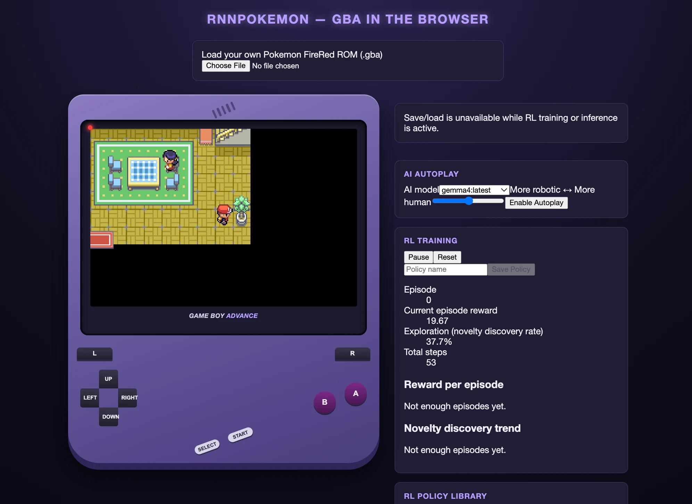

# pokemonGBAGemmaPlay



Browser-based GBA emulator for playing a user-supplied Pokemon FireRed ROM, with local save states and two autoplay modes:

- **LLM autoplay** — driven by a locally-running Ollama vision model.
- **RL autoplay** — a from-scratch DQN reinforcement-learning agent, trained in-browser with TensorFlow.js.

Frontend-only React 19 + TypeScript SPA. No application backend. The only external process is your own Ollama instance at `http://localhost:11434` (RL training needs no external process — just GPU/CPU in-browser).

> You must supply your own legally-owned FireRed ROM. This project never bundles or downloads one.

## Requirements

- Node.js
- A legally-owned Pokemon FireRed ROM (`.gba` file)
- For LLM autoplay: [Ollama](https://ollama.com) running locally with a vision-capable model

## Commands

```sh
npm run dev          # Vite dev server on :5173 (COOP/COEP headers configured — required)
npm run build         # tsc -b && vite build
npm run lint          # eslint .
npm run format        # prettier --write .
npm test              # vitest run (unit + integration)
npx vitest run tests/unit/keyboard.test.ts        # single test file
npx vitest run -t 'partial test name'             # single test by name
npm run test:e2e      # Playwright; SKIPS unless E2E_ROM_PATH points to a .gba ROM
```

For LLM autoplay, start Ollama with CORS allowed for the dev server:

```sh
OLLAMA_ORIGINS="http://localhost:5173" ollama serve
```

## Architecture

- `EmulatorCore` (`src/emulator/types.ts`, implemented by `MgbaEmulatorCore` in `src/emulator/core.ts`) is the load-bearing boundary — everything else depends on this interface, never directly on `@thenick775/mgba-wasm`.
- `src/ai/` — LLM autoplay pipeline (`DecisionLoop` → Ollama `/api/generate` → button press).
- `src/rl/` — RL training/inference pipeline (frame processing → DQN agent → replay buffer → reward model).
- `src/services/gameSession.ts` — tiny subscribe/getState store for app-wide session state.
- `src/storage/` — IndexedDB persistence for save states (`saveStates.ts`) and trained RL policies (`rlPolicies.ts`).

See `CLAUDE.md` for full architectural detail and invariants.

## Spec-driven development

This repo uses [Spec Kit](https://github.com/), with two feature specs layered on the same codebase:

- `specs/001-browser-gba-emulator/` — the emulator core, save states, and LLM autoplay.
- `specs/002-rl-autoplay-training/` — the DQN training/inference mode layered on top.

Each spec dir contains `spec.md`, `plan.md`, `research.md`, `data-model.md`, `contracts/`, and `tasks.md`.
